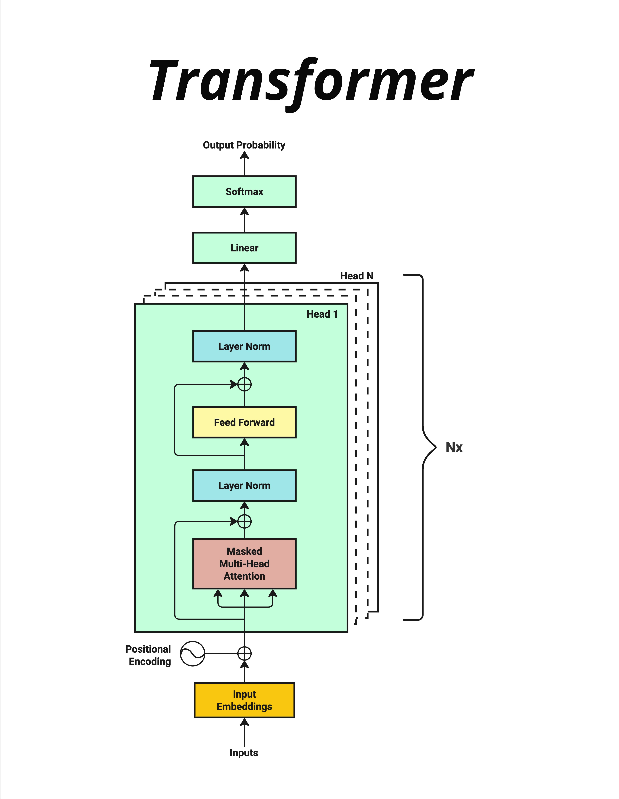

# Part 1：Building-Intuition建立直觉

> 本阶段目标：用最通俗的语言理解 GPT 和 Transformer 是什么

## 章节列表

| 章节        | 主题                        |
| --------- | ------------------------- |
| Chapter01 | GPT是什么 - LLM发展简史与核心思想     |
| Chapter02 | 大模型的本质 - "就是两个文件"         |
| Chapter03 | Transformer全景图 - 谁都能听懂的版本 |
这里先展示transformers的经典结构, 来自于[《Attention Is All You Need》](sources/attention_is_all_you_need.pdf)，[原文地址](https://arxiv.org/abs/1706.03762)：

## 学完本阶段后
你将能够：
- 向非技术人员解释什么是 GPT
- 理解大模型的本质结构
- 对 Transformer 有全局直觉