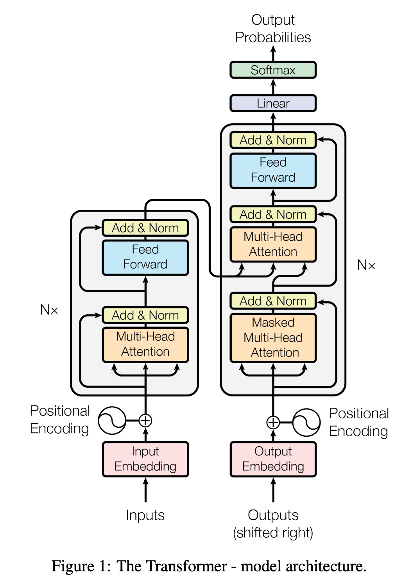

这一部分主要讲[《Attention is All You Need》](https://arxiv.org/abs/1706.03762)中提到的Transformers 模型，它标志着深度学习尤其是序列处理领域的一次重大变革；它彻底改变了NLP~自然语言处理，甚至广泛应用于图像处理、多模态学习、以及科学计算等领域，以及彻底成为现代大模型的核心基本盘技术（例如GPT, BERT, LLaMA, Qwen等），模型结构如下：
 
在本章节中，我会将不同关键模块进行切分，以此介绍Transformers的相关技术知识点，为后续大模型学习夯实基础：
- [1.1 Tokenization 分词](1.1-Tokenization分词.md)
- [1.2 Word Embedding 词嵌入](1.2-Word-Embedding词嵌入.md)
- [1.3 Position Embedding 位置编码](1.3-Position-Embedding位置编码.md)
- [1.4 Attention 注意力机制](1.4-Attention注意力机制.md)
- [1.5 FFN & Activation 前馈神经网络和激活函数](1.5-FFN-and-Activation前馈神经网络和激活函数.md)
- [1.6 Mask 掩码](1.6-Mask掩码.md)
- [1.7 Normalization 标准化](1.7-Normalization标准化.md)
- [1.8 Encoder vs. Decoder](1.8-Encoder-vs-Decoder.md)
- [1.9 Decoding 解码技术](1.9-Decoding解码技术.md)
 